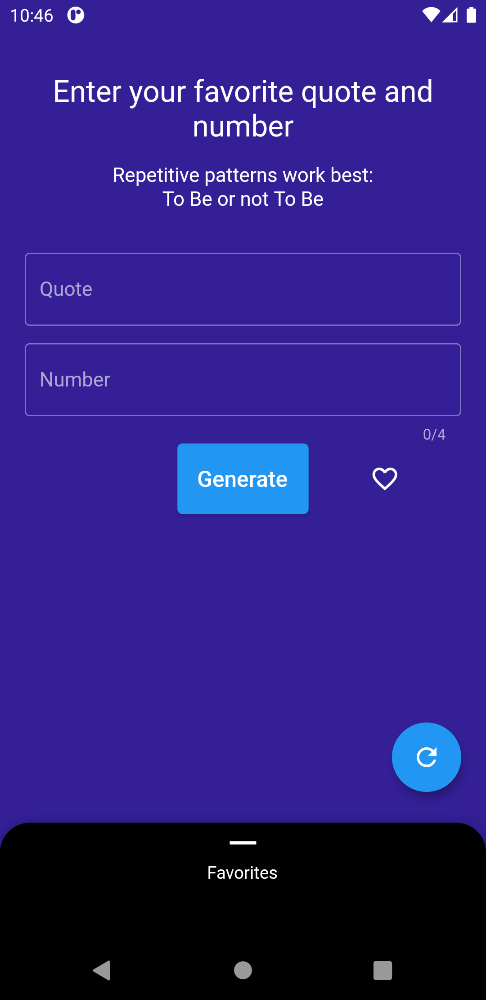
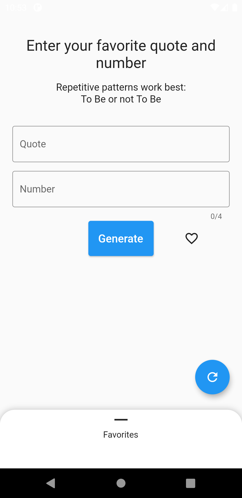
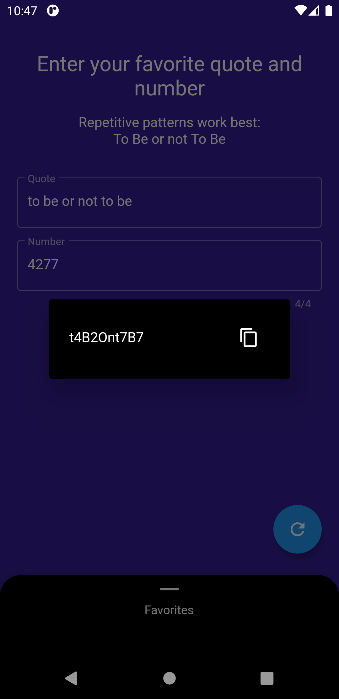
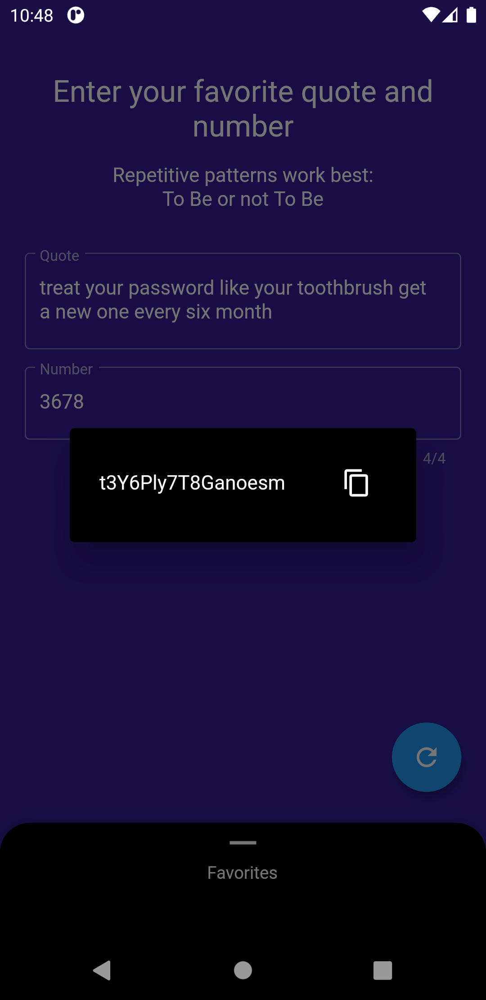
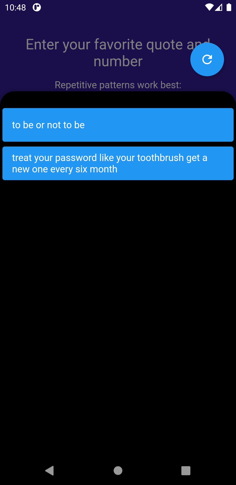

# ciphatron

Generate highly secured passwords from a quote.

## Why ?

We tend to use the same password with known words or names. This dramatically
increases the risk of being hacked.
Ciphatron finally gives you a way to use highly secured passwords without having
to remember them ✅

## How ?

It gets every first letter of the quote, search for any recurrent one and
inserts the number you provided. So you only have to remember your favorite
quote and number to have a very strong password 🔒.

## Advantage

Ciphatron doesn't save your passwords. It only saves your favorite quotes. So
you have to type the 4 digits, like a pin code 1️⃣2️⃣3️⃣4️⃣

## Exemple

> Treat your password like your toothbrush. Get a new one every six months.

> 3678 (what you actually have to remember 🧠)

👉 `t3Y6Ply7T8Ganoesm`

## Preview

